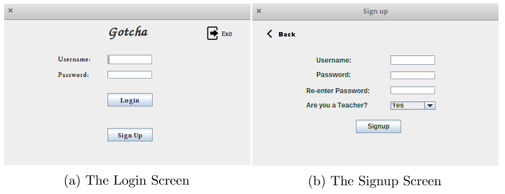
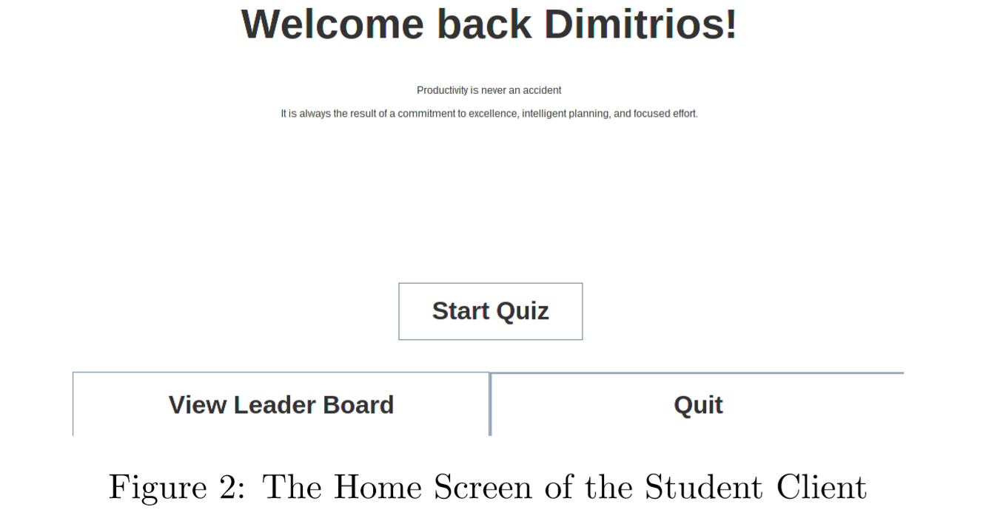
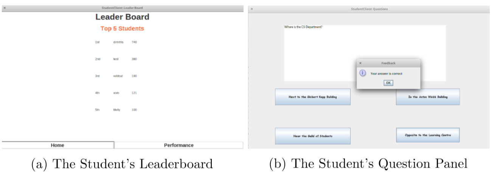
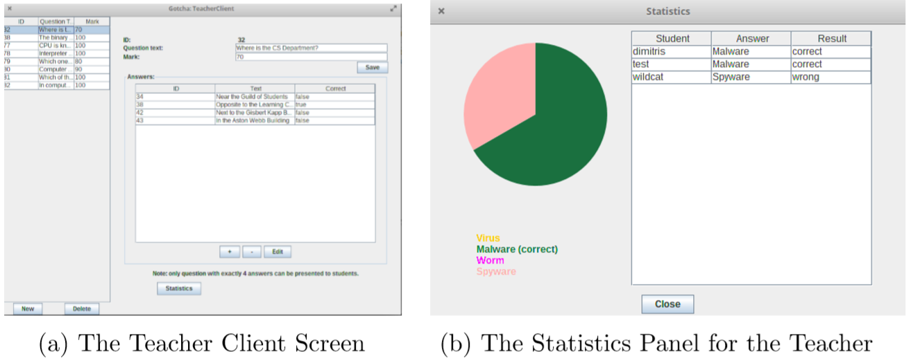

# Gotcha

Gotcha  - Learning Platform

This is a group project of team Middlesbrough, part of the curriculum in the MSc Computer Science in the University of Birmingham. 
Team Middlesbrough members: Daohan Chong, Dimitrios Simopoulos, Melisha Trout, Yang He.

’Gotcha’ is a game-based learning platform that challenges the student’s knowledge within a particular area. Its objective is to allow students to actively learn a topic against their peers. Allowing the students to compete with each another establishes a sense of competition which will hopefully encourages the students to return back to the game. It also allows teachers to submit questions to their students to test their knowledge within a particular topic i.e. science, history, politics etc. 
The project was influenced from two different platforms. The first one was Canvas, where the students use it daily either to study and get informed about a course or to complete their assignments and their quizzes. The other one was Kahoot, as it was used for learning purposes in the Operating Systems and Networks Module.

#### Login/Signup Screen

#### Home Screen

#### LeaderBoard & UI Screens

#### Results & Statistics Screens

